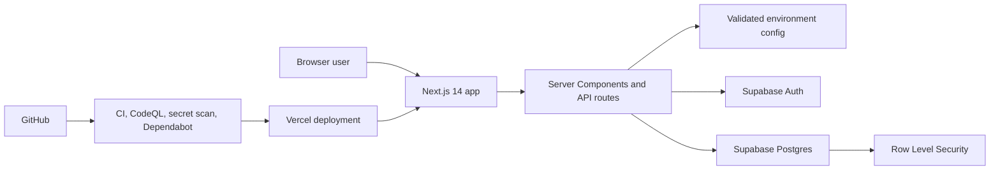

# Trip Planner

[](https://github.com/nattapongsindhu/Trip-Planner/actions/workflows/test.yml)
[](https://github.com/nattapongsindhu/Trip-Planner/actions/workflows/codeql.yml)
[](./LICENSE)

A full-stack multi-trip planning application built with Next.js 14, TypeScript, Supabase, and Tailwind CSS.

Designed as a portfolio project that demonstrates CRUD workflows, server-side authentication, Row Level Security, optimistic UI updates, and production-oriented DevSecOps practices.

**Live demo:** https://trip-planner-rho-coral.vercel.app

## About the developer

Built by **Nattapong Sindhu**, an IT Cybersecurity student at Los Angeles City College and full-time USPS Maintenance Mechanic. This project is used to demonstrate practical engineering habits around secure defaults, deployment workflows, and defense in depth.

**Focus areas:** IT Security, DevSecOps, secure full-stack development, production readiness

## Features

- Multi-trip management with create, edit, and delete flows
- Day-by-day itinerary with transport, highlights, notes, and cost ranges
- Per-trip visibility control with database-enforced access policies
- Hotel comparison and selected accommodation tracking
- Budget tracker with estimated vs actual spending
- Progress tracking for itinerary completion
- Public read access with authenticated write access
- Light and dark mode support
- Route-level loading and error states for core pages

## Tech stack

| Layer | Technology |
| --- | --- |
| Framework | Next.js 14 (App Router) |
| Language | TypeScript |
| Database | Supabase (PostgreSQL) |
| Auth | Supabase Auth (magic link) |
| Styling | Tailwind CSS |
| Validation | Zod |
| Testing | Vitest + V8 coverage |
| CI/CD | GitHub Actions -> Vercel |
| Security automation | CodeQL, TruffleHog, Dependabot |

## Security

This project treats security as a first-class engineering concern.

- Row Level Security is enforced in PostgreSQL, not only in UI logic.
- Magic link auth avoids local password storage.
- Environment variables are validated before Supabase clients are created.
- Publishable keys are used for SSR and browser auth flows, while secret keys stay isolated to admin-only scripts such as seeding.
- CI includes CodeQL, secret scanning, linting, type checks, coverage, and build verification.

See [SECURITY.md](./SECURITY.md) for vulnerability disclosure and response expectations.

## Documentation

- [Setup Guide](./docs/SETUP.md)
- [Architecture and data flow](./docs/ARCHITECTURE.md)
- [Repository governance](./docs/REPOSITORY-GOVERNANCE.md)
- [Contributing guide](./CONTRIBUTING.md)
- [Changelog](./CHANGELOG.md)
- [Security policy](./SECURITY.md)
- [Privacy policy](https://trip-planner-rho-coral.vercel.app/privacy)
- [Terms of service](https://trip-planner-rho-coral.vercel.app/terms)

## Quick start

```bash
git clone https://github.com/nattapongsindhu/Trip-Planner.git
cd Trip-Planner
npm install
cp .env.example .env.local
npm run seed
npm run dev
```

Full setup instructions, including Supabase and Vercel configuration, live in [docs/SETUP.md](./docs/SETUP.md).

The app now prefers `NEXT_PUBLIC_SUPABASE_PUBLISHABLE_KEY` and `SUPABASE_SECRET_KEY`. Legacy `anon` and `service_role` variable names remain supported temporarily to make rollout safer.

## Architecture overview



More detail, including request flow and module boundaries, is in [docs/ARCHITECTURE.md](./docs/ARCHITECTURE.md).

## Engineering workflow

- `CI` runs linting, type checking, coverage-aware tests, and a production build on every push and pull request.
- `CodeQL` scans JavaScript and TypeScript for common security issues.
- `TruffleHog` scans the working tree for verified secrets before code is merged.
- `Dependabot` keeps npm packages and GitHub Actions updated weekly.
- Issue forms, PR template, CODEOWNERS, changelog, and contributing docs make the repo review-ready.

## Project structure

```text
/app
  page.tsx
  layout.tsx
  loading.tsx
  error.tsx
  privacy/page.tsx
  terms/page.tsx
  auth/callback/route.ts
  trip/
    new/page.tsx
    [id]/
      page.tsx
      loading.tsx
      error.tsx
      edit/page.tsx
  api/
    auth/route.ts
    trips/
      route.ts
      [id]/
        route.ts
        days/route.ts
        hotels/route.ts
        budget/route.ts

/components
  AuthButton.tsx
  BudgetTracker.tsx
  DayList.tsx
  Footer.tsx
  NewTripForm.tsx
  ThemeToggle.tsx
  TripEditForm.tsx
  VisibilityToggle.tsx

/lib
  env.ts
  env.test.ts
  formatters.ts
  formatters.test.ts
  supabaseClient.ts
  supabaseServer.ts

/docs
  ARCHITECTURE.md
  REPOSITORY-GOVERNANCE.md
  SETUP.md

/.github
  dependabot.yml
  CODEOWNERS
  PULL_REQUEST_TEMPLATE.md
  workflows/
    test.yml
    codeql.yml
    secret-scan.yml
```

## Key technical decisions

- **App Router over Pages Router** keeps data fetching close to the route and reduces client-side plumbing.
- **Server Components plus Supabase SSR** keep sensitive behavior on the server while still allowing interactive client sections.
- **Row Level Security** is the primary authorization boundary for data reads and writes.
- **Shared env parsing** gives one place to validate runtime configuration for local development, CI, and deployment.
- **Reducer-based UI state** keeps optimistic updates explicit in itinerary, hotel, and budget editors.

## Running checks

```bash
npm run lint
npm run typecheck
npm run test:coverage
npm run build
```

## Delivery roadmap

**Near-term**

- Multi-user ownership with `user_id`-scoped RLS
- Rate limiting on API routes
- Error tracking and observability

**Medium-term**

- Google Maps or weather integrations
- Packing checklist and transport-leg entities
- More granular feature-layer organization under `features/`

**Long-term**

- Itinerary optimization by distance or travel time
- PDF export
- Internationalization

## License

MIT. See [LICENSE](./LICENSE).
