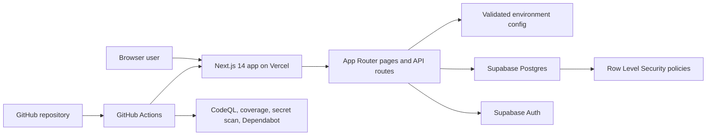
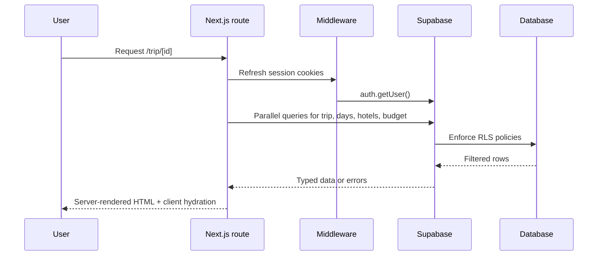

# Architecture

Trip Planner is a Next.js App Router application backed by Supabase and deployed on Vercel. The design goal is to keep read access simple, write access protected, and deployment concerns visible enough for a portfolio reviewer to audit quickly.

## System context

## Request and data flow

## Module boundaries

- `app/`: route handlers, server components, loading states, and error boundaries.
- `components/`: interactive UI and reducers for itinerary, hotels, and budget editing.
- `lib/`: environment parsing, formatters, and Supabase client factories.
- `supabase/migrations/`: schema, indexes, and RLS policies treated as deployable infrastructure.
- `.github/`: CI, CodeQL, secret scanning, Dependabot, and review templates.

## Reliability and security controls

- Server-rendered data fetching keeps privileged logic off the client.
- Shared environment validation prevents silent misconfiguration in local, CI, and production environments.
- Route-level `loading.tsx` and `error.tsx` files give users feedback during slow or failed requests.
- GitHub Actions enforce linting, type checks, tests with coverage thresholds, and production build verification.
- CodeQL and TruffleHog add automated code scanning and secret detection to the review pipeline.

## Scaling path

- Introduce feature folders under `features/` if itinerary, budget, and auth flows continue to grow.
- Extract a service layer for Supabase queries once multiple routes share the same data access logic.
- Add request-level observability, rate limiting, and multi-user ownership policies before opening write access beyond a single admin.
